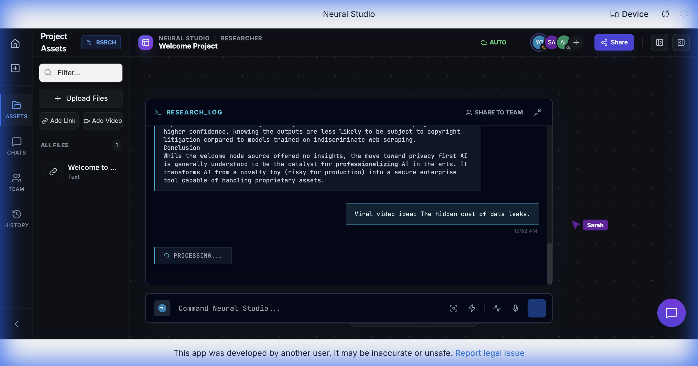

# Neural Studio

<div align="center">

</div>

## Overview

**Neural Studio is the first AI canvas that bridges the gap between deep research and creative execution.**

While other tools force you to switch between chats, docs, and browser tabs, Neural Studio provides a privacy-first, infinite workspace where you can gather sources in **Research Mode**, and instantly transform them into scripts, storyboards, and content in **Creative Mode**—without ever losing context. It's not just a chatbot; it's a complete operating system for your ideas.

## Features

### 🧠 Dual-Mode Intelligence
- **Researcher Mode**: Drag-and-drop PDFs, videos, and links. The AI analyzes them, clusters themes, and generates citations automatically.
- **Creator Mode**: Switch context instantly to generate viral hooks, video scripts, and visual storyboards using the grounded knowledge from your research.

### ♾️ Infinite Canvas
- **Spatial Organization**: Organize your thoughts, files, and AI-generated content on an infinite 2D plane.
- **Smart Grouping**: AI automatically clusters related nodes and ideas.

### 🔒 Privacy-First
- **Local-First Design**: Your data stays with you.
- **Secure Context**: Enterprise-grade privacy standards for your intellectual property.

## Getting Started

### Prerequisites
- Node.js (v18 or higher)
- npm or yarn

### Installation

1.  Clone the repository:
    ```bash
    git clone https://github.com/yourusername/neural-studio.git
    cd neural-studio
    ```

2.  Install dependencies:
    ```bash
    npm install
    ```

3.  Configure Environment:
    Copy `.env.local.example` to `.env.local` and add your Gemini API key:
    ```bash
    cp .env.local.example .env.local
    ```
    *(Note: You need to create this file if it doesn't exist)*

4.  Run the application:
    ```bash
    npm run dev
    ```

## Technology Stack

- **Frontend**: React, TypeScript, Vite
- **AI Integration**: Google Gemini API (Multimodal)
- **State Management**: React Context / Hooks
- **Styling**: Tailwind CSS

## License

MIT
